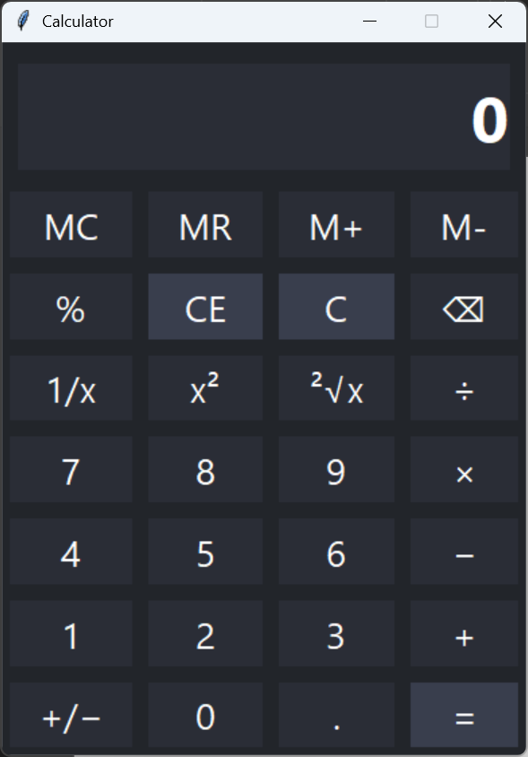

# PyCalMVC

A simple Windows-style calculator application built with Python's Tkinter, following the MVC (Model-View-Controller) design pattern.

> **Note:**  
> Portions of this codebase and documentation were generated or refined with assistance from [ChatGPT](https://chat.openai.com/).

---

## Demo



---

## Features

- Windows-inspired GUI using Tkinter
- Clear MVC architecture for maintainability and extensibility
- Immediate execution mode (left-to-right, no operator precedence)
- Memory functions: MC, MR, M+, M-
- Percentage, square, square root, reciprocal, sign flip, and backspace (⌫)
- Comprehensive unit tests for the Model layer

---

## Getting Started

### Requirements

- Python 3.7 or higher

### Usage

Clone the repository and run the application:

```bash
git clone https://github.com/Scott530810/PyCalMVC.git
cd PyCalMVC
python calculator.py
```

---

## Running Unit Tests

To run the unit tests for the Model logic:

```bash
python test_calculator_model.py
```

---

## File Structure

```
calculator.py             # Main application (Controller + View)
calculator_model.py       # Model: Core calculator logic
test_calculator_model.py  # Unit tests for the Model
README.md
LICENSE
.gitignore
screenshot.png
```

---

## License

This project is licensed under the MIT License.  
Portions of the code and documentation were generated or adapted with the assistance of ChatGPT by OpenAI.  
See [LICENSE](LICENSE) for details.

---

## Author

[Scott530810](https://github.com/Scott530810)
